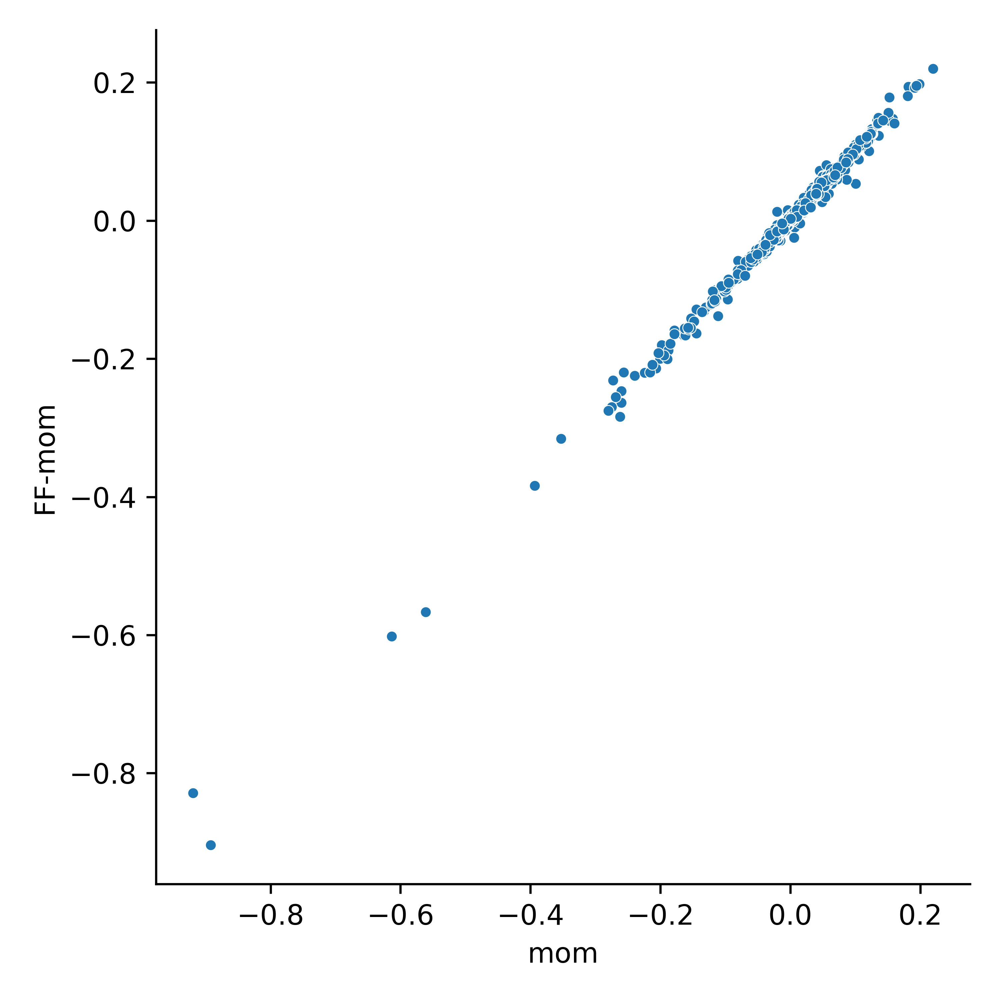
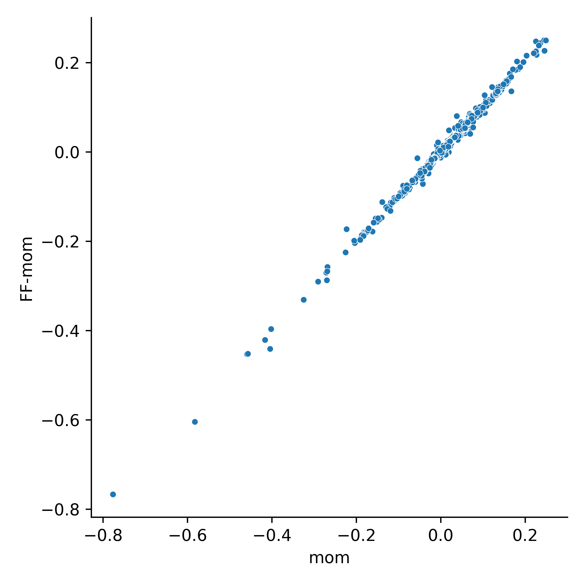

# Momentum

This repo is a replication of momentum investing strategy.

## Introduction
**Jegadeesh and Titman (1993)** presented momentum in their seminal paper [Returns to Buying Winners
and Selling Losers: Implications for Stock Market Efficiency](https://www.jstor.org/stable/2328882) (*Journal of Finance*).

Momentum refers to the phenomenon that past winner stocks (based on past 3- to 12-month returns)
continue to perform well while past loser stocks continue to have lower returns up to next 12 months.

## Motivation
Momentum is a prominent market anomaly that attracts academics and practitioners attention. However,
there are some empirical test variations and different authors may make different decisions when
dealing with data. And it is not crystal clear in many papers how authors process the data. I would
like to see how those decisions affect momentum profits.

## Data
- Data is from CRSP between Dec 1925 and Mar 2022.
- Common stocks. `shrcd` = 10 or 11
- Stock exchanges - NYSE/AMEX/NASDAQ. `exchcd` is from -2 to 3.

### Zero market values
CRSP has zero market values (111 observations and 18 unique stocks). Remove them or not?

|   permno | date       |     ret |   me |
|---------:|:-----------|--------:|-----:|
|    23633 | 1974-05-31 | -0.2778 |    0 |
|    23633 | 1974-06-30 |  0.0769 |    0 |
|    23633 | 1974-07-31 | -0.1429 |    0 |
|    23633 | 1974-08-31 | -0.3333 |    0 |
|    23633 | 1974-09-30 | -0.0625 |    0 |
|    23633 | 1974-10-31 |  0.4    |    0 |
|    23633 | 1974-11-30 |  0.1905 |    0 |
|    23633 | 1974-12-31 | -0.2    |    0 |

### Month gaps
There are some big gaps between months. Do all authors deal with such cases when calculating lagged
returns? If yes, for example, past 6-month return might include returns several years ago.


|   permno | date       |     ret |   month_diff |
|---------:|:-----------|--------:|-------------:|
|    64426 | 1986-10-31 |  0.0471 |            1 |
|    64426 | 1986-11-30 |  0.001  |            1 |
|    64426 | 1986-12-31 | -0.0117 |            1 |
|    64426 | 1994-01-31 |  0      |           85 |
|    64426 | 1994-02-28 |  0.1    |            1 |
|    64426 | 1994-03-31 | -0.1818 |            1 |
|    64426 | 1994-04-30 | -0.1667 |            1 |
|    64426 | 1994-05-31 |  0      |            1 |

### Missing returns
Some authors fill missing returns with zeros. In the example below, past 6-month return is zero (even
there are no valid returns during past 6 months) and the stock will be included when forming
portfolios. Does this make sense if including the stock?

In the case below, adding requirement of valid market value will reduce the effect of this issue (but
not 100%).

|   permno | date       |      ret |        me |   exchcd |
|---------:|:-----------|---------:|----------:|---------:|
|    10007 | 1987-09-30 |   0.2063 |   9.804   |        3 |
|    10007 | 1987-10-31 |  -0.5263 |   4.644   |        3 |
|    10007 | 1987-11-30 |  -0.3611 |   2.967   |        3 |
|    10007 | 1987-12-31 | nan      | nan       |        0 |
|    10007 | 1988-01-31 | nan      | nan       |        0 |
|    10007 | 1988-02-29 | nan      | nan       |        0 |
|    10007 | 1988-03-31 | nan      | nan       |        0 |
|    10007 | 1988-04-30 | nan      | nan       |        0 |
|    10007 | 1988-05-31 | nan      | nan       |        0 |
|    10007 | 1988-06-30 | nan      | nan       |        0 |
|    10007 | 1988-07-31 | nan      | nan       |        0 |
|    10007 | 1988-08-31 | nan      | nan       |        0 |
|    10007 | 1988-09-30 | nan      | nan       |        0 |
|    10007 | 1988-10-31 | nan      | nan       |        0 |
|    10007 | 1988-11-30 | nan      | nan       |        0 |
|    10007 | 1988-12-31 | nan      | nan       |        0 |
|    10007 | 1989-01-31 | nan      | nan       |        0 |
|    10007 | 1989-02-28 | nan      |   9.3075  |        3 |
|    10007 | 1989-03-31 |  -0.1471 |   7.93875 |        3 |
|    10007 | 1989-04-30 |   0.069  |   8.48625 |        3 |

## How to use
### Python packages
Required packages to run the codes
- pandas
- numpy
- wrds
- statsmodels
- matplotlib
- seaborn
- yaml
- pandas-datareader

### Run the code
You can use `table.py` to produce the results.

For example, options below will try to follow the empirical settings of Jegadeesh and Titman (1993)

```python
j, k, n_port = 6, 6, 10
fill_na = True
skip = False
no_gap = False
size = None
price = None
exchange = [1, 2]
nyse_bp = False
use_duckdb = True
ret_type = 'ew'
start_date = '1965-01-31'
end_date = '1989-12-31'
nw_lag = 3

portew, momew = mom_port(msf, j, k, n_port, fill_na, skip, no_gap,
    size, exchange, use_duckdb, ret_type, start_date, end_date, nw_lag)
```

There are many options you can configure to test momentum under different settings.

<dl>
<dt><strong>j</strong></dt>
<dd>Number of month for lagged returns</dd>

<dt><strong>k</strong></dt>
<dd>Number of month for holding period</dd>

<dt><strong>n_port</strong></dt>
<dd>Number of groups, e.g.10 means deciles</dd>

<dt><strong>fill_na</strong></dt>
<dd>If <i>True</i>, fill missing returns with zeros</dd>
<dd>If <i>False</i>, do not fill missing returns with zeros</dd>

<dt><strong>skip</strong></dt>
<dd>If <i>True</i>, skip (exclude) return in formation month when computing lagged j-month return</dd>
<dd>If <i>False</i>, include return in formation month when computing lagged j-month return</dd>

<dt><strong>no_gap</strong></dt>
<dd>If <i>True</i>, replace lagged j-month returns with missing if the difference between formation month and the lagged jth month is not equal to j-1</dd>
<dd>If <i>False</i>, no control for month gaps</dd>

<dt><strong>size</strong></dt>
<dd>If <i>None</i> (ignore this argument), do not require valid market value in formation month for the stocks</dd>
<dd>If 1, require positive market values</dd>
<dd>If 2, exclude small stocks (small stocks are defined as stocks with market value less than 20% percentile of NYSE stocks)</dd>

<dt><strong>price</strong></dt>
<dd>Minimum stock price, e.g. 5 means that stocks with price less than 5 dollar will be removed</dd>
<dd>If <i>None</i>, no control for stock price</dd>

<dt><strong>exchange</strong></dt>
<dd>If <i>None</i> (ignore this argument), use NYSE(1)/AMEX(2)/NASDAQ(3)</dd>
<dd>Note - NYSE must be included if use NYSE breakpoints</dd>

<dt><strong>nyse_bp</strong></dt>
<dd>If <i>True</i>, use NYSE breakpoints to rank stocks</dd>
<dd>If <i>False</i>, use breakpoints of all stocks to rank stocks</dd>

<dt><strong>use_duckdb</strong></dt>
<dd>If <i>True</i>, use duckdb to perform conditional merge (4x to 5x faster)</dd>
<dd>If <i>False</i>, use chunk by chunk full merge</dd>

<dt><strong>ret_type</strong></dt>
<dd>If <i>'ew'</i>, equal-weighted returns</dd>
<dd>If <i>'vw'</i>, value-weighted returns</dd>

<dt><strong>start_date</strong></dt>
<dd>Start month of portfolio return</dd>

<dt><strong>end_date</strong></dt>
<dd>End month of portfolio return</dd>

<dt><strong>nw_lag</strong></dt>
<dd>Number of lags when computing t-value with Newey-West standard error</dd>
</dl>

## Compare with Fama-French momentum
- Momentum strategy: j=12, k=1
- Sample: 1927-01-31 to 2022-03-31

### Equal-weighted
- MOM

| port               |    ret |    t |     p |
|:-------------------|-------:|-----:|------:|
| 1 (loser)          | 0.0113 | 3.11 | 0.002 |
| 2                  | 0.0115 | 3.88 | 0     |
| 3                  | 0.0113 | 4.42 | 0     |
| 4                  | 0.0124 | 4.97 | 0     |
| 5                  | 0.0122 | 5.5  | 0     |
| 6                  | 0.0131 | 6.13 | 0     |
| 7                  | 0.0134 | 6.4  | 0     |
| 8                  | 0.0144 | 6.84 | 0     |
| 9                  | 0.0157 | 7.4  | 0     |
| 10 (winner)        | 0.0179 | 7.29 | 0     |
| mom (winner-loser) | 0.0066 | 2.89 | 0.004 |

- FF MOM

| port               |    ret |    t |     p |
|:-------------------|-------:|-----:|------:|
| 1 (loser)          | 0.0099 | 2.76 | 0.006 |
| 2                  | 0.0115 | 3.83 | 0     |
| 3                  | 0.0114 | 4.49 | 0     |
| 4                  | 0.0124 | 4.98 | 0     |
| 5                  | 0.0123 | 5.56 | 0     |
| 6                  | 0.0132 | 6.12 | 0     |
| 7                  | 0.0134 | 6.43 | 0     |
| 8                  | 0.0144 | 6.81 | 0     |
| 9                  | 0.0158 | 7.45 | 0     |
| 10 (winner)        | 0.0179 | 7.29 | 0     |
| mom (winner-loser) | 0.0079 | 3.59 | 0     |


- Correlation of momentum (winner-loser): 0.997



### Value-weighted
- MOM

| port               |    ret |    t |     p |
|:-------------------|-------:|-----:|------:|
| 1 (loser)          | 0.0037 | 1.23 | 0.22  |
| 2                  | 0.0074 | 3    | 0.003 |
| 3                  | 0.0079 | 3.72 | 0     |
| 4                  | 0.0091 | 4.74 | 0     |
| 5                  | 0.0092 | 5.09 | 0     |
| 6                  | 0.0095 | 5.5  | 0     |
| 7                  | 0.0103 | 6.46 | 0     |
| 8                  | 0.0112 | 7.01 | 0     |
| 9                  | 0.0119 | 7.06 | 0     |
| 10 (winner)        | 0.0149 | 7.44 | 0     |
| mom (winner-loser) | 0.0112 | 4.85 | 0     |

- FF MOM

| port               |    ret |    t |     p |
|:-------------------|-------:|-----:|------:|
| 1 (loser)          | 0.0035 | 1.15 | 0.252 |
| 2                  | 0.0076 | 3.05 | 0.002 |
| 3                  | 0.0077 | 3.69 | 0     |
| 4                  | 0.0092 | 4.77 | 0     |
| 5                  | 0.0091 | 5.09 | 0     |
| 6                  | 0.0097 | 5.54 | 0     |
| 7                  | 0.0103 | 6.44 | 0     |
| 8                  | 0.0112 | 7.01 | 0     |
| 9                  | 0.012  | 7.1  | 0     |
| 10 (winner)        | 0.015  | 7.48 | 0     |
| mom (winner-loser) | 0.0115 | 4.92 | 0     |

- Correlation of momentum (winner-loser): 0.998


